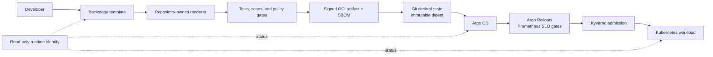

# ForgePath

[](https://github.com/SecureCloudOps/ForgePath/actions/workflows/validation.yml?query=branch%3Amain)

ForgePath is a local, end-to-end implementation of a secure platform-engineering
paved path. A developer generates a production-minded FastAPI service from
Backstage; ForgePath validates the source and manifests, builds and signs an
immutable artifact, promotes its digest through Git, reconciles it with Argo CD,
enforces admission with Kyverno, and returns read-only runtime status to
Backstage.


[View the complete catalog, TechDocs, Kubernetes, and Argo CD screenshot set.](docs/screenshots/README.md)

## Why ForgePath

- **One reproducible developer path:** Backstage and the command line use the
  same repository-owned service renderer.
- **Evidence before promotion:** tests, policy checks, vulnerability scans, an
  SPDX SBOM, an immutable digest, and a local signature travel through explicit
  validation gates.
- **GitOps with a constrained feedback loop:** Argo CD and Kyverno control
  delivery while Backstage receives status through a deliberately read-only
  Kubernetes identity.

## How it works



The v1 scope is deliberately narrow: one template, one service, one local
environment, one failure scenario, one drift scenario, and one admission
rejection. Crossplane, AI, more templates, and multi-cloud support are future
work.

## Quick start

### Prerequisites

- macOS or Linux with Git, Make, and a Bash-compatible shell;
- [mise](https://mise.jdx.dev/) for the pinned toolchain; and
- a running Docker engine.

Install the pinned tools and run the non-cluster release gates from the
repository root:

```sh
mise install
make validate-v1-static
```

`validate-v1-static` does not contact or mutate a Kubernetes cluster. It does
build containers and may download locked packages or base images on the first
run. It does not fetch Trivy vulnerability data. Run `make validate-security`
when both the static checks and the explicitly online cached vulnerability gate
are required.

Run the local Backstage portal:

```sh
cd platform/backstage
corepack yarn install --immutable
corepack yarn start
```

Choose **Create → Secure FastAPI service**. Output is confined to
`.forgepath/generated/`; Backstage cannot publish it or register it remotely.

## What the gates prove

| Gate | Command | Evidence |
| --- | --- | --- |
| Repository foundation | `make validate-foundation` | Required structure, documentation, architecture stages, and shell safety |
| Paved path and security | `make validate-security` | Tests, scans, schemas, Helm, OPA, and Kyverno CLI negative fixtures |
| Observability static | `make validate-observability-static` | Prometheus rules, 96.67% degradation fixture, dashboard, Helm resources, and restricted scrape policy |
| Vulnerability data (online) | `make validate-observability-online` | One cached Trivy DB snapshot followed by update-disabled filesystem and image scans |
| Observability runtime | `make validate-observability-runtime` | Disposable Kind proof of live scraping, controlled degradation, and fast-burn alert firing |
| Progressive delivery static | `make validate-progressive-delivery-static` | Rollout stages, stable/canary Services, fail-closed Prometheus analysis, GitOps allowlist, render, and policy checks |
| Trusted artifact | `make validate-trusted-artifact` | OCI archive, Trivy report and DB fingerprint, SPDX SBOM, digest, and locally verified ephemeral signature |
| Backstage | `make validate-backstage-static` | Pinned app and MkDocs toolchain, rendered TechDocs, catalog, renderer confinement, and permissions |
| GitOps | `make validate-gitops-static` | Restricted AppProject/Application, trusted digest handoff, render, schema, and policy checks |
| Backstage + Argo runtime | `make validate-backstage-runtime` | Disposable Kind deployment, reconciliation, read-only Backstage workload and Application status, and RBAC denials |
| Kyverno runtime | `make validate-kyverno-runtime` | Compliant admission and unsafe Pod rejection through the Kubernetes API |

GitHub Actions runs the static paved-path security gate, the separately labeled
online Trivy gate, and the Backstage static gate on pull requests and pushes to
`main`. Runtime proofs remain local because they deliberately create disposable
Kubernetes clusters.

Runtime gates create, mutate, and delete only named disposable Kind clusters.
They require explicit approval under `AGENTS.md`, refuse pre-existing target
clusters, verify context before mutation, restore the original context, and
clean up on exit.

## Read-only runtime identity

`backstage-runtime-reader` receives only `get`, `list`, and `watch` for selected
workload resources and the matching Argo CD `Application`. The runtime gate
explicitly proves denial of:

- Secrets and credential/token access;
- Pod deletion and exec;
- workload creation, update, patch, and deletion;
- Argo CD Application update/patch (including sync); and
- Backstage's raw Kubernetes proxy permission.

Backstage holds no Argo CD API token and exposes no sync control.

## Final validation

After approval for the disposable cluster mutations:

```sh
make validate-v1
```

That command, together with the recorded screenshot set, is the ForgePath v1
completion criterion.

## Repository map

| Path | Purpose |
| --- | --- |
| `templates/` | Backstage-compatible secure service template and renderer |
| `services/` | Rendered reference service, Helm chart, catalog metadata, and TechDocs |
| `policies/` | OPA/Conftest and Kyverno enforcement policies |
| `gitops/` | Restricted Argo CD project, application, and local desired state |
| `platform/backstage/` | Pinned local portal and read-only runtime integration |
| `scripts/` and `tests/` | Executable validation gates and negative fixtures |

## Documentation

- [Architecture](docs/ARCHITECTURE.md)
- [End-to-end demo and screenshot checklist](docs/DEMO.md)
- [Progressive-delivery abort runbook](services/secure-fastapi-service/docs/progressive-delivery.md)
- [V1 validation evidence](docs/evidence/V1_VALIDATION.md)
- [V2 observability validation evidence](docs/evidence/V2_VALIDATION.md)
- [Threat model](docs/THREAT_MODEL.md)
- [GitOps design and rollback](gitops/README.md)
- [Backstage boundary](platform/backstage/README.md)
- [Roadmap](docs/ROADMAP.md)
- [ADRs](docs/adr/README.md)

## License

ForgePath is licensed under the [Apache License 2.0](LICENSE).

Copyright 2026 Mohamed SecureCloudOps. See [NOTICE](NOTICE).
