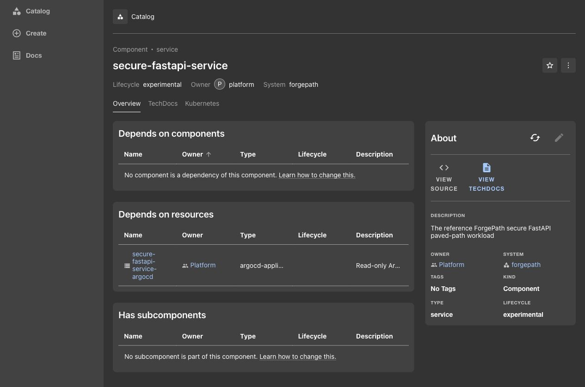
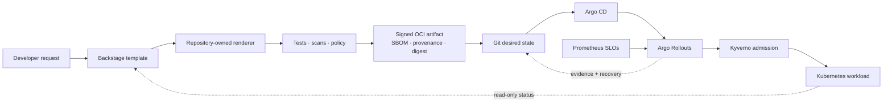

# ForgePath v2

[](https://github.com/SecureCloudOps/ForgePath/actions/workflows/validation.yml?query=branch%3Amain)

ForgePath is a local, evidence-driven internal developer platform reference. It
turns one authenticated Backstage request into a production-minded FastAPI
service, validates the source and Kubernetes configuration, builds a signed
immutable artifact, promotes its digest through Git, reconciles it with Argo CD,
and uses Prometheus SLOs plus Argo Rollouts to contain a defective canary.

The important result is not a collection of platform tools. It is one paved
path whose security, delivery, recovery, and developer-experience claims are
backed by executable gates and retained evidence.



[Browse the UI proof](docs/screenshots/README.md) ·
[Explore the architecture](docs/ARCHITECTURE.md) ·
[Review the evidence index](docs/evidence/README.md) ·
[Open the portfolio overview](docs/portfolio/README.md) ·
[Read the incident postmortem](docs/evidence/postmortems/INC-20260824T152814Z.md) ·
[Review the v2 release notes](CHANGELOG.md)

## What ForgePath v2 proves

| Outcome | Recorded proof |
| --- | --- |
| One-action self-service | 1 manual developer action, 0 required Kubernetes manifests, 9 inherited controls |
| Fast local publication | Request to repository in 0.021s; first PR-ready branch in 0.099s |
| Governed delivery | Git-held immutable digest, restricted Argo CD project, fail-closed Kyverno admission |
| Progressive containment | Defective revision stopped at 5% exposure while the stable Service stayed healthy |
| Operational response | MTTD 270.265s, MTTA 8.543s, MTTR 374.620s, human-approved Git recovery |
| Verifiable supply chain | Clean-source provenance (`source_dirty=false`), SPDX SBOM, Trivy pass, detached Cosign verification |

These are measurements from disposable local runtime exercises, not production
benchmarks. The source documents and raw-evidence locations are cataloged in the
[evidence index](docs/evidence/README.md).

## The paved path



Backstage does not build images, hold an Argo CD token, expose a sync control,
or receive write access to the cluster. Git is the only application-delivery
control plane. See [Architecture](docs/ARCHITECTURE.md) for trust boundaries,
ownership, and incident flow.

## Why this project is different

- **Developer speed is inherited, not improvised.** The portal and CLI share one
  repository-owned renderer and reject unsafe requests before generation.
- **Security controls are executable.** Digest-only images, ownership metadata,
  restricted PSA, default-deny networking, workload identity, and narrow
  exceptions all have negative tests.
- **Runtime claims are separated from static claims.** Cluster proofs are named,
  disposable, approval-gated, context-checked, and cleaned up.
- **Failure is treated as evidence.** Failed exercises are preserved, defects in
  the harness are corrected without weakening containment, and recovery remains
  human-approved.

## Run the local gates

Prerequisites: macOS or Linux, Git, Make, a Bash-compatible shell,
[mise](https://mise.jdx.dev/), and a running Docker engine.

Install the pinned toolchain and run the non-cluster release gates:

```sh
mise install
make validate-v1-static
```

Run a focused foundation check:

```sh
make validate-foundation
```

The static gate does not contact or mutate Kubernetes. It may build containers
and download locked packages or base images on first use. Vulnerability data is
an explicit online gate:

```sh
make validate-security
```

After explicit approval for the named disposable clusters, run the complete
local proof:

```sh
make validate-v1
```

Every runtime harness refuses a pre-existing target cluster, verifies the exact
Kind context before mutation, restores the original context, and deletes its
cluster on exit.

## Validation map

| Capability | Representative gate | What it demonstrates |
| --- | --- | --- |
| Foundation and service | `make validate-foundation` / `make validate-secure-fastapi` | Repository contract, renderer, service tests, chart render, schema and policy checks |
| Supply chain | `make validate-trusted-artifact` | OCI archive, clean-source metadata, Trivy report, SPDX SBOM, digest and local signature |
| GitOps and admission | `make validate-gitops-static` / `make validate-kyverno-runtime` | Restricted reconciliation, immutable promotion, compliant admission and negative fixtures |
| Platform boundaries | `make validate-platform-guardrails-static` | Ownership, approved registry, provenance, namespace, identity and exception controls |
| Observability | `make validate-observability-static` | Availability/latency SLOs, error budget, burn alerts, dashboard and restricted scrape path |
| Progressive delivery | `make validate-progressive-delivery-static` | 5/25/50/100 canary stages and fail-closed Prometheus analysis |
| Developer experience | `make validate-developer-self-service` | Golden-path publication, inherited controls and pre-generation rejection cases |
| Incident readiness | `make validate-incident-exercise-static` | Metric derivation, evidence integrity, human checkpoint and postmortem contract |

The [evidence index](docs/evidence/README.md) maps every material claim to its
permanent record and, where retained locally, its raw evidence bundle.

## Repository map

| Path | Responsibility |
| --- | --- |
| `platform/backstage/` | Authenticated developer entry point and read-only runtime integration |
| `templates/` | Secure service template and shared renderer |
| `services/` | Rendered reference service, Helm chart, catalog metadata and TechDocs |
| `policies/` | OPA/Conftest and Kyverno policy source plus negative fixtures |
| `gitops/` | Restricted Argo CD project, Application and local desired state |
| `scripts/` and `tests/` | Static gates, disposable runtime proofs and incident harness |
| `docs/evidence/` | Evidence index, validation records, corrective-action closure and postmortem |

## Scope and boundaries

ForgePath v2 deliberately proves one template, one service, one local GitOps
environment, one controlled defective release, and one human-approved recovery
path. It does not claim multi-cluster fleet management, production paging,
regional traffic behavior, or a hosted control plane. Those gaps are kept
visible in the [roadmap](docs/ROADMAP.md) and postmortem.

## Documentation

- [Architecture and trust boundaries](docs/ARCHITECTURE.md)
- [ForgePath v2 portfolio overview](docs/portfolio/README.md)
- [Evidence index](docs/evidence/README.md)
- [Operational incident exercise](docs/evidence/INCIDENT_EXERCISE.md)
- [Trusted-artifact provenance closure](docs/evidence/TRUSTED_ARTIFACT_PROVENANCE.md)
- [End-to-end demo](docs/DEMO.md)
- [Threat model](docs/THREAT_MODEL.md)
- [GitOps design and recovery](gitops/README.md)
- [Backstage boundary](platform/backstage/README.md)
- [Roadmap](docs/ROADMAP.md)
- [Architecture Decision Records](docs/adr/README.md)
- [v2 release notes](CHANGELOG.md)
- [Security policy](SECURITY.md)

## License

ForgePath is licensed under the [Apache License 2.0](LICENSE).

Copyright 2026 Mohamed SecureCloudOps. See [NOTICE](NOTICE).
