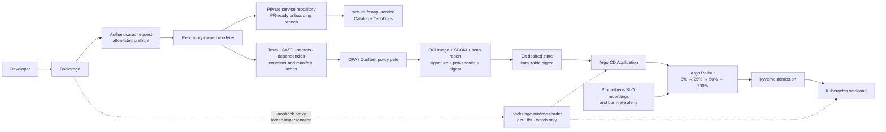
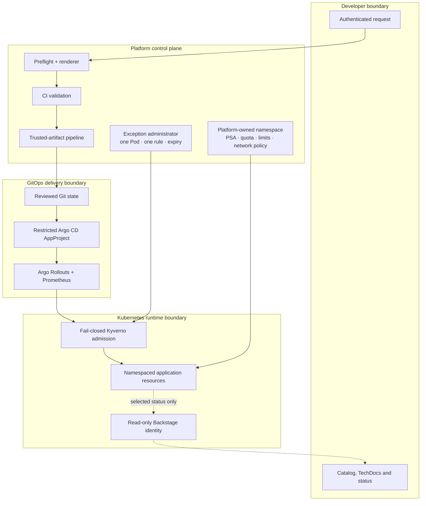
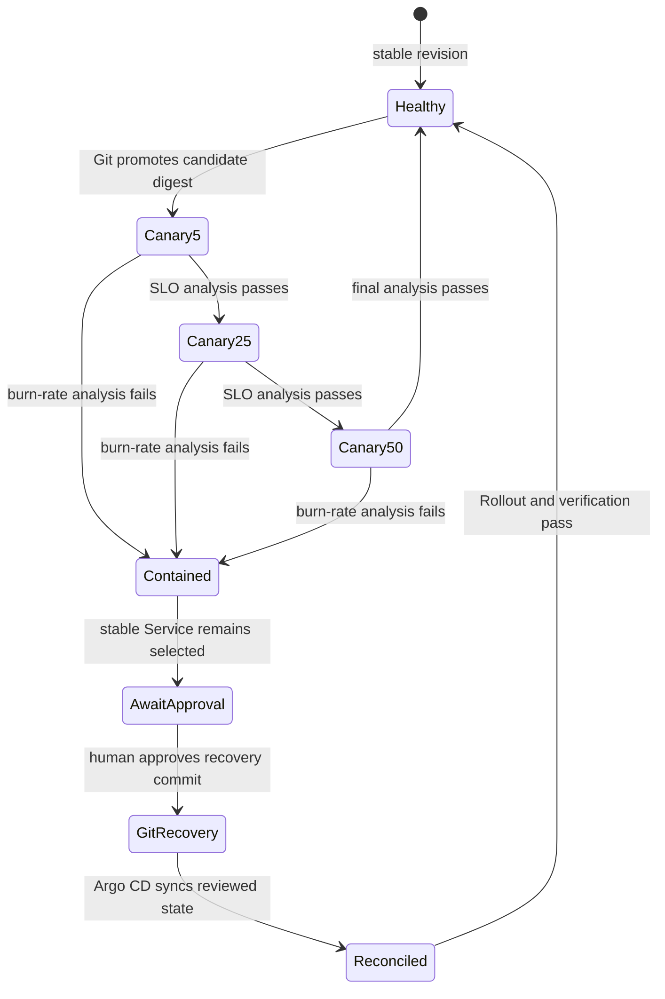
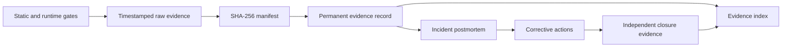

# ForgePath v2 architecture

ForgePath implements one secure paved path from developer intent to a measured,
recoverable Kubernetes service. Every solid delivery arrow below is implemented;
every material trust boundary has a static or disposable runtime gate.

## System flow

The portal creates intent; it does not become a deployment controller. The
repository-owned renderer is the shared implementation behind portal and CLI
flows, while Git remains the only source of application desired state.

## Trust boundaries and control ownership

| Boundary | Allowed responsibility | Explicitly excluded |
| --- | --- | --- |
| Backstage | Identity-aware validation, one constrained create action, Catalog/TechDocs and read-only status | Image builds, cluster mutation, Argo CD credentials or sync controls |
| Publisher | Allowlisted private service/GitOps repositories and PR-ready branches | Arbitrary organizations, public repositories or direct production mutation |
| CI validation | Reject unsafe source, dependencies, images and manifests | Promotion after a failed gate |
| Trusted-artifact pipeline | Bind OCI archive, scan, SPDX SBOM, signature, provenance and digest | Mutable tags or retained private signing keys |
| Git | Hold reviewed desired state and the approved immutable digest | Hidden imperative rollback state |
| Argo CD | Reconcile and self-heal inside one restricted AppProject | Cluster-scoped application ownership |
| Platform namespace owner | Own namespace lifecycle, PSA, quota, limits and network policy | Application-owned namespace creation |
| Argo Rollouts | Scale stable/canary ReplicaSets and fail closed on SLO analysis | Automatic Git recovery |
| Kyverno | Enforce independent admission policy | Silent bypasses or broad exclusions |
| Exception administrator | Time-bounded one-Pod/one-rule PolicyExceptions | Wildcards, multiple controls or application-owned exceptions |
| `backstage-runtime-reader` | `get`, `list`, `watch` on selected workload and Application objects | Secrets, exec, delete, mutation, token requests or sync |

## Progressive delivery and recovery

The basic canary is replica weighted and has no traffic router. On abort, the
controller contains the candidate promptly; the incident harness therefore
captures candidate logs and configuration immediately after alert
acknowledgment, before post-abort scale-down.

Recovery is a reviewed Git change. The runtime exercise does not imperatively
roll back Argo CD and does not create the recovery commit until the human
checkpoint is satisfied.

## Evidence flow

Raw runtime bundles are intentionally ignored by Git because they can be large
and environment-specific. Permanent records retain measurements, exact hashes,
source revisions, cleanup results and raw bundle locations. Failed proofs stay
visible and are not rewritten into successful results.

## Reconciliation and admission details

The application AppProject permits only the reference repository, exact target
namespace and required namespaced kinds. Platform automation provisions the
governed namespace separately. Argo CD proves initial sync, drift repair,
revision reconciliation, create and prune behavior.

Kyverno complements the pre-deployment OPA gate. Runtime proofs admit the
compliant chart and reject privileged, root, mutable-image, missing-resource,
host-network, host-PID, unsigned and unattested requests through the Kubernetes
API. Narrow exceptions never edit the source policy and immediately revert to
denial when removed or expired.

See the [evidence index](evidence/README.md) for claim-to-proof mapping and the
[incident postmortem](evidence/postmortems/INC-20260824T152814Z.md) for the
measured recovery path.
