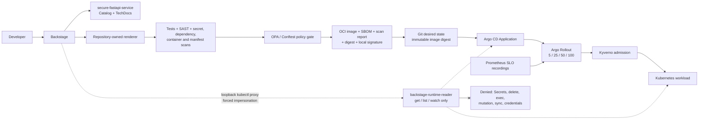

# ForgePath v1 architecture

ForgePath provides one secure paved path and one reference service. Every arrow
below is implemented and has a local validation gate; no external service is
required for the demo.

## Trust and ownership boundaries

| Boundary | Responsibility |
| --- | --- |
| Backstage | Local catalog, TechDocs, one renderer action, and read-only status |
| CI validation | Reject unsafe source, dependencies, images, and manifests |
| Trusted-artifact pipeline | Build and bind scan, SBOM, signature, and digest evidence |
| Git | Hold reviewed desired state and the approved immutable digest |
| Argo CD | Reconcile Git state; self-heal and prune within one restricted AppProject |
| Argo Rollouts | Keep stable/canary selectors, scale weighted ReplicaSets, and abort failed SLO analysis |
| Kyverno | Fail closed on non-compliant Kubernetes admission requests |
| Kubernetes | Run the workload and enforce RBAC/admission decisions |

Backstage does not publish repositories, register remote entities, build or
promote images, apply Kubernetes resources, hold an Argo CD token, or expose a
sync button. The only scaffolder action delegates to the same repository-owned
Python renderer used by the CLI and writes beneath `.forgepath/generated/`.

## Runtime visibility boundary

The catalog Component selects the workload namespace. A related catalog
Resource selects the matching Argo CD Application in the `argocd` namespace;
this separation is required because Backstage's Kubernetes entity annotation
accepts one namespace per entity.

The disposable runtime proof creates a dedicated service account with two
namespaced Roles. Their rules contain only `get`, `list`, and `watch` for the
configured workload object types and `applications.argoproj.io`. A loopback-only
kubectl proxy always impersonates that service account. Kubernetes RBAC denies
Secrets, Pod deletion and exec, workload mutation, service-account token
requests, and Application updates/patches; Backstage separately denies its raw
`kubernetes.proxy` permission.

## Reconciliation and admission

Git is the desired-state source of truth. The Argo CD runtime gate proves
initial sync/health, repair of direct replica drift, reconciliation to a new Git
revision, creation, and pruning. Rollback is a reviewed Git revert, not an
imperative Argo CD rollback.

Kyverno complements the pre-deployment OPA gate. Its independent runtime proof
admits the compliant chart and rejects privileged, root, mutable-image,
missing-resource, host-network, and host-PID Pods through the Kubernetes API.

See [the v1 demo](DEMO.md) for the exact sequence and final command.
