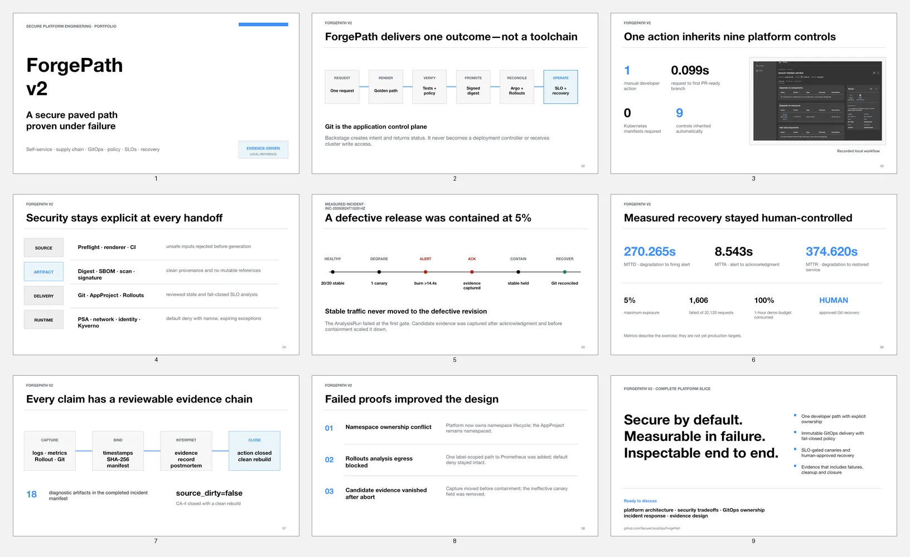

# ForgePath v2 portfolio overview

This concise overview is for platform-engineering leaders, hiring teams and
technical reviewers. It presents ForgePath as one complete platform slice:
developer self-service, supply-chain evidence, GitOps delivery, security
boundaries, SLO-gated canaries, measured incident response and
corrective-action closure.

## Narrative

1. ForgePath is a secure paved path proven under failure.
2. The platform delivers one outcome rather than exposing a toolchain.
3. One developer action inherits nine controls.
4. Security ownership stays explicit at every handoff.
5. A defective revision was contained at 5%.
6. MTTD, MTTA and MTTR were measured while Git recovery remained human-approved.
7. Each claim has a hash-bound evidence chain.
8. Failed proofs improved the design without weakening controls.
9. The result is a deliberately narrow but complete, inspectable platform slice.

## Evidence basis

The overview uses repository evidence only and introduces no external claims.
The supporting records are linked from the
[evidence index](../evidence/README.md), including the measured incident
[postmortem](../evidence/postmortems/INC-20260824T152814Z.md).
